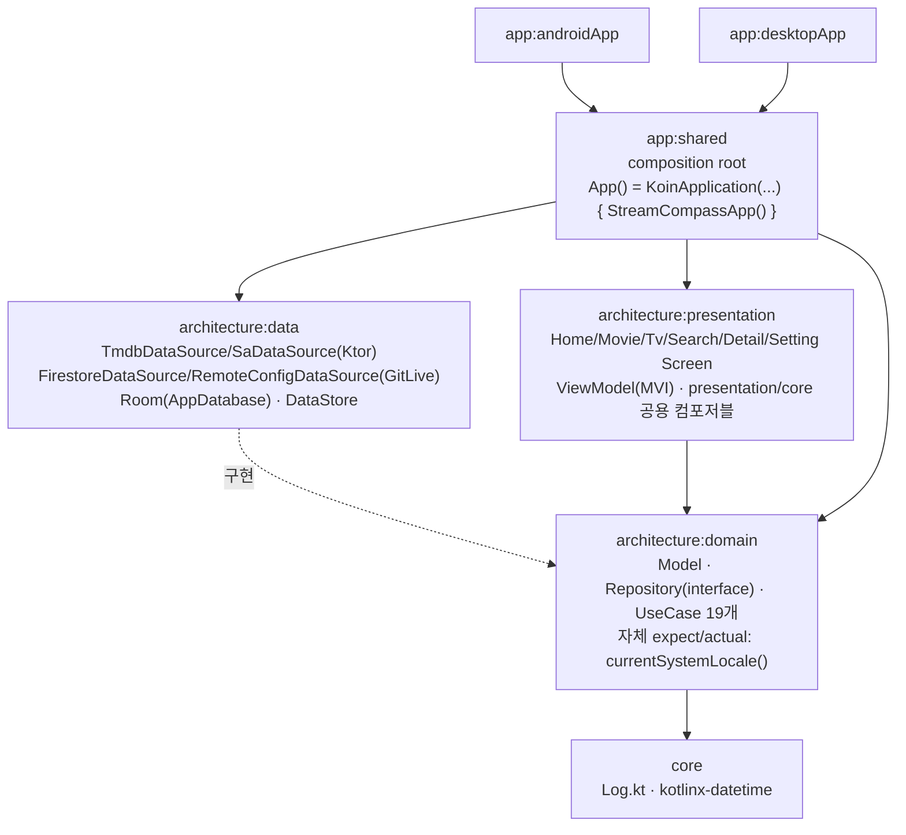
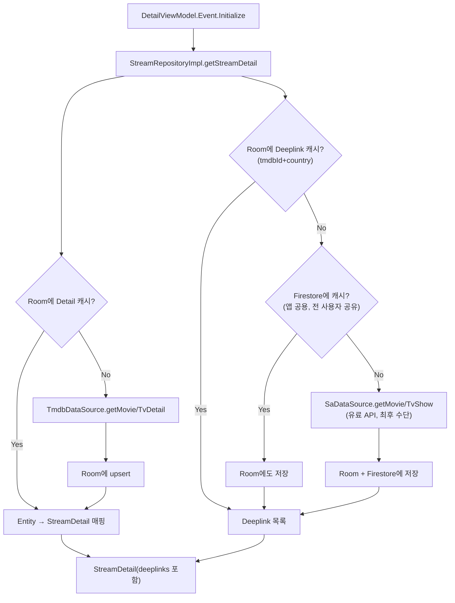
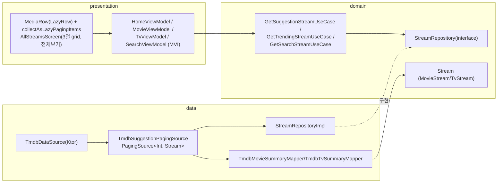

<p align="center">
  
</p>

<h1 align="center">Watchly</h1>

<p align="center">
Kotlin Multiplatform(Compose Multiplatform) 기반 스트리밍 탐색 앱.<br/>
영화/TV 정보를 검색하고, 어느 OTT 서비스에서 볼 수 있는지 확인하고, 찜/시청 기록을 관리합니다.
</p>

<p align="center">
  
  
  
  
</p>

---

Watchly는 [TMDB](https://www.themoviedb.org/documentation/api)(작품 메타데이터)와 [Streaming Availability API](https://www.movieofthenight.com/about/api)(OTT 서비스별 시청 링크)를 결합해, "이 작품을 어디서 볼 수 있는지"까지 한 화면에서 확인할 수 있는 개인 포트폴리오 프로젝트입니다. Android와 Desktop(JVM) 두 플랫폼을 하나의 코드베이스(Compose Multiplatform)로 구현했고, Clean Architecture 3-module 구조로 domain/data/presentation 계층을 분리했습니다.

## 주요 기능

- **Home** — 오늘의 인기작 Carousel, 신작 영화/TV, 찜한 영화/TV, 최근 시청한 영화/TV까지 총 7개의 row.
- **Movie / Tv** — 카테고리별(상영중/인기/평점 높은/개봉 예정 등) row + row별 "전체보기"(3열 grid, Paging).
- **Search** — 검색 기록 우선 노출(YouTube 스타일 1단계) → 검색어 입력 시 Movie/Tv 탭 + 3열 grid 결과(2단계)로 전환. 뒤로가기 시 검색 히스토리 화면으로 복귀.
- **Detail** — 5개 탭(Overview/About/Recommended/Review/Series) 구성. 포스터 공유 요소 전환 애니메이션(SharedElementTransition), OTT 서비스별 시청 딥링크, 시즌·에피소드 목록.
- **Watchlist(찜) / History(시청 기록)** — 포스터 long-press로 찜 추가/삭제, Detail 화면의 원형 아이콘 토글, Home에 전용 row 노출.
- **Setting** — 라이트/다크/시스템 테마 전환(DataStore 저장).
- **시스템 로케일 연동** — 기기 언어/지역(OS locale)에 따라 TMDB `language`/`watch_region`, Streaming Availability `country` 파라미터를 자동으로 맞춤(하드코딩된 `en-US` 없음).

## 아키텍처

Uncle Bob의 Clean Architecture 원칙에 따라 **Repository 인터페이스는 domain, 구현은 data**에 둔 3-module 구조입니다. 전 모듈이 `jvm()` + `android()` 타겟만 가지는 순수 KMP 모듈입니다.



### 데이터 흐름 · Detail 조회 (Room → Firestore → SA, 3단계 캐시)

Streaming Availability API는 호출량 기반 과금이 있는 유료 API라, 동일한 `(tmdbId, country)` 조합을 여러 사용자가 반복 조회하지 않도록 **기기 로컬(Room) → 앱 공용(Firestore) → 원본(SA API)** 순으로 캐시를 확인합니다.



> Season/Episode(Series 탭)만 예외입니다 — 항상 최신 정보가 필요하다고 판단해 Room/Firestore 어디에도 캐싱하지 않고 매번 새로 가져옵니다.

### 데이터 흐름 · Suggestion/Trending/Search (Paging)



- Home: `/trending/all/day`(movie+tv 혼합 Carousel) + New Movies/New Tv(discover, `watch_monetization_types=flatrate`) + Movie/Tv Watchlist + Movie/Tv History, 총 7개 row.
- Movie: NowPlaying/Popular/TopRated/Upcoming 4개 poster row. Tv: AiringToday/OnTheAir/Popular/TopRated 4개 backdrop row. 각 row 제목 옆 "전체보기" → 같은 `PagingSource`를 재사용하는 3열 grid.
- Search: TMDB `search/movie`·`search/tv` + Room 검색 기록(newest-first). 1단계(검색 기록만 노출) → 2단계(Movie/Tv 탭 + 3열 grid 결과)로 전환.

### Presentation 계층 · MVI 패턴

화면(Home/Movie/Tv/Search/Detail/Setting/AllStreams)마다 ViewModel 1개, 모두 동일한 단일 리듀서 파이프라인을 따릅니다.

- `eventChannel: Channel<Event>`가 유일한 이벤트 진입점. `.onStart { emit(Event.Initialize) }`로 초기 로드도 같은 파이프라인을 태움(별도 State 파이프라인에서 경쟁 emit하지 않음).
- `.runningFold(initial = State(), operation = ::handleEvent)`로 이벤트를 리듀스, `.stateIn(started = SharingStarted.Lazily)`로 `StateFlow` 노출 — `WhileSubscribed(5_000)`이 아니라 `Lazily`로 통일한 이유는, 5초 이상 화면을 벗어났다가 돌아오면 상류 Flow가 재구독되며 리스트가 처음부터 다시 로드되는 문제가 있었기 때문.
- Room Flow(History/Watchlist 관찰)는 `merge()`+Event 변환 대신 `State`의 필드로 Flow를 그대로 노출 — DB 변경이 생기면 Compose 쪽에서 자연스럽게 반영.

### Domain UseCase 목록

| UseCase                                                                                                 | 용도                                            |
|---------------------------------------------------------------------------------------------------------|-----------------------------------------------|
| `GetSuggestionStreamUseCase`                                                                            | Movie/Tv 카테고리별 추천 목록(Paging)                  |
| `GetTrendingStreamUseCase`                                                                              | Home Trending Carousel                        |
| `GetStreamDetailUseCase`                                                                                | Detail 상세 조회(Room→Firestore→SA 3단계 캐시)        |
| `GetRecommendationsUseCase`                                                                             | Detail의 Recommended 탭                         |
| `GetReviewsUseCase`                                                                                     | Detail의 Review 탭(로케일 무관, TMDB 리뷰 대부분 en-US)   |
| `GetSeasonsUseCase` / `GetEpisodesUseCase`                                                              | Detail의 Series 탭(캐시 없이 항상 최신)                 |
| `GetSearchStreamUseCase` / `RecordSearchHistoryUseCase` / `GetSearchHistoryUseCase`                     | Search 화면                                     |
| `RecordHistoryUseCase` / `GetHistoryStreamUseCase` / `RemoveHistoryUseCase`                             | 시청 이력(History)                                |
| `AddWatchlistUseCase` / `GetWatchlistStreamUseCase` / `RemoveWatchlistUseCase` / `IsWatchlistedUseCase` | 찜(Watchlist)                                  |
| `GetThemeModeUseCase` / `SetThemeModeUseCase`                                                           | Setting의 다크/라이트/시스템 테마                        |
| `InitializeAppUseCase`                                                                                  | 앱 시작 시 Firebase Remote Config에서 API Key fetch |

## 설계 결정

- **Secret 관리** — TMDB/Streaming Availability API Key를 앱에 하드코딩하지 않고 Firebase Remote Config로 런타임에 배포. 앱 시작 시 fetch에 실패하면 초기화 실패로 처리(`InitializeAppUseCase`).
- **History/Watchlist 테이블은 Detail 캐시와 독립** — `movie_history`/`tv_history`/`movie_watchlist`/`tv_watchlist`는 `Stream` 필드를 그대로(+타임스탬프) 저장하고 `movie_detail`/`tv_detail` 캐시와 조인하지 않음 — 캐싱 로직을 화면 목적별로 완전히 분리하는 편이 유지보수에 유리하다는 판단.
- **Room DB는 version 1 유지** — 앱 미출시 상태라 마이그레이션 인프라를 아직 두지 않음(`fallbackToDestructiveMigration`도 미사용). 스키마 변경 시 기존 로컬 DB가 초기화될 수 있음을 감수.
- **`presentation/core` 공용화 기준(YAGNI)** — 실제로 2곳 이상에서 반복되는 UI(`MediaRow`/`PosterCard`/`BackdropCard`)만 공용 컴포저블로 추출. 화면 전용 로직(예: History의 빈 상태 문구)은 억지로 공용 컴포저블에 밀어넣지 않고 해당 화면에 로컬로 둠.
- **Top bar auto-hide** — `ScrollState`를 각 화면 내부가 아니라 상위 `MainScreen`에서 hoist(Home/Movie/Tv 각각 별도 인스턴스 → 탭 전환해도 스크롤 위치 유지). 현재 탭이 최상단이 아니면 top bar를 숨김.
- **함수 호출은 항상 named argument** — 가독성과 리팩터링 안전성을 위한 프로젝트 전역 컨벤션.

## 알려진 제약사항

- **Desktop(JVM) Firebase Remote Config 미지원** — GitLive SDK의 JVM 타겟에서 Remote Config가 동작하지 않는 것으로 확인됨(Firestore는 JVM에서도 정상 동작). Desktop 빌드에서 API Key를 받아오는 별도 경로(로컬 override)가 필요하며 아직 미구현.
- **Carousel 좁은 화면 중앙 정렬 한계** — Hero 아이템 폭(16:9 고정)과 좌우 peeking 아이템 폭의 합이 360dp대의 좁은 화면 폭을 초과할 수 있어, 일부 기기에서 완전한 대칭 중앙 정렬이 안 될 수 있음.

## 기술 스택 & 오픈소스 라이브러리

- **최소 SDK**: Android API 24, Kotlin 2.3.20
- **UI**: [Compose Multiplatform](https://github.com/JetBrains/compose-multiplatform) · Material3 · [Coil3](https://github.com/coil-kt/coil)(비동기 이미지 로딩, SVG 지원)
- **비동기/구조화**: Kotlin Coroutines & Flow · [AndroidX Paging 3](https://developer.android.com/topic/libraries/architecture/paging/v3-overview)(공용 모듈로 이관해 KMP `PagingSource` 직접 구현)
- **DI**: [Koin](https://insert-koin.io/)(`koin-compose-viewmodel`)
- **네트워킹**: [Ktor Client](https://ktor.io/)(Android=OkHttp engine, Desktop=CIO engine) + kotlinx.serialization
- **로컬 저장소**: [Room](https://developer.android.com/kotlin/multiplatform/room)(KMP) · AndroidX DataStore Preferences
- **백엔드 연동**: [Firebase](https://firebase.google.com/)(GitLive Kotlin SDK) — Remote Config(API Key 배포), Firestore(딥링크 공유 캐시)
- **네비게이션**: [Navigation Compose](https://developer.android.com/develop/ui/compose/navigation) — `@Serializable` sealed class 기반 type-safe route
- **빌드**: [BuildKonfig](https://github.com/yshrsmz/BuildKonfig)(플랫폼별 빌드 타임 상수), KSP

## 빌드 방법

이 프로젝트는 API Key를 **Firebase Remote Config**를 통해 런타임에 받아옵니다. 로컬에서 직접 빌드하려면:

1. [Firebase 콘솔](https://console.firebase.google.com/)에서 프로젝트를 생성하고 Android 앱(`applicationId: com.sunstar.streamcompass`)을 등록해 `google-services.json`을 내려받아 `app/androidApp/google-services.json`에 위치시킵니다(git-ignore 대상 — 저장소에는 포함되어 있지 않습니다).
2. Firebase Remote Config에 아래 두 파라미터를 등록하고 값(각 서비스에서 발급받은 API Key)을 채운 뒤 게시(Publish)합니다.

   | 파라미터 키         | 값                                                                                |
   |----------------|----------------------------------------------------------------------------------|
   | `TMDB_API_KEY` | [TMDB API](https://www.themoviedb.org/documentation/api)에서 발급받은 키                |
   | `SA_API_KEY`   | [Streaming Availability API](https://www.movieofthenight.com/about/api)에서 발급받은 키 |

3빌드:

   ```bash
   # Android
   ./gradlew :app:androidApp:assembleDebug

   # Desktop (JVM)
   ./gradlew :app:desktopApp:run
   ```

## 프로젝트 구조

```
StreamCompass/
├── app/
│   ├── androidApp/        # Android 진입점 (MainActivity)
│   ├── desktopApp/        # Desktop(JVM) 진입점 (main())
│   └── shared/             # commonMain composition root (Koin 조립)
├── architecture/
│   ├── domain/             # Model · Repository(interface) · UseCase
│   ├── data/                # DataSource(TMDB/SA/Firestore/RemoteConfig) · Room · Repository 구현
│   └── presentation/        # Compose 화면 · ViewModel(MVI)
└── core/                   # 순수 공용 유틸리티
```

---

본 프로젝트는 포트폴리오 목적의 개인 프로젝트입니다.
