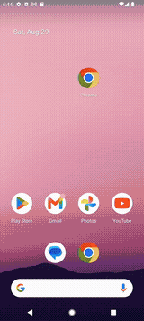
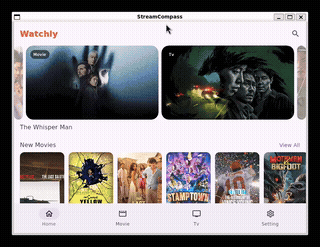
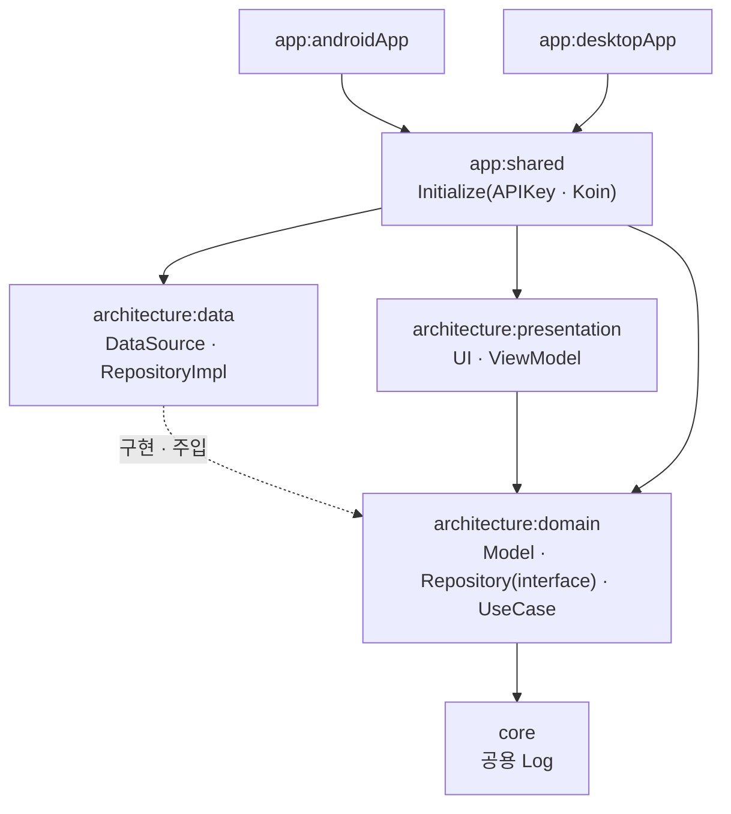
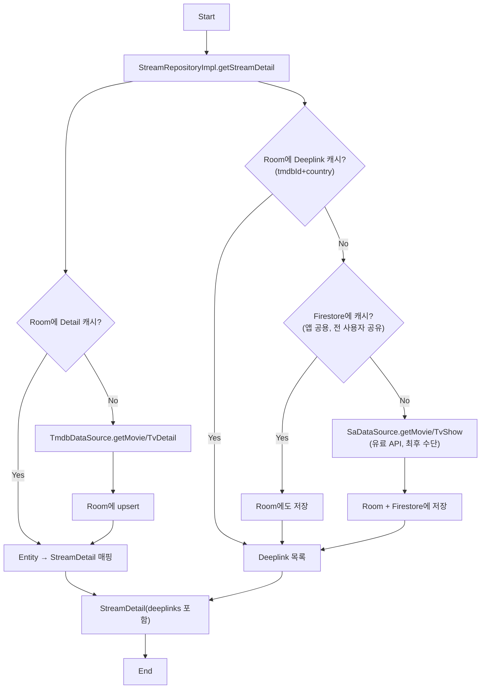
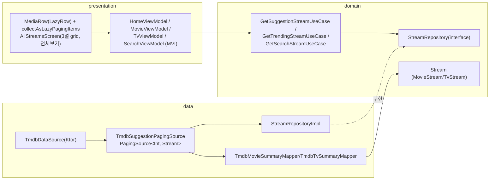

<p align="center">
  
</p>

<h1 align="center">Watchly</h1>

<p align="center">
Kotlin Multiplatform(Compose Multiplatform) 기반 스트리밍 탐색 앱.<br/>
영화/TV 정보를 검색하고, 어느 OTT 서비스에서 볼 수 있는지 확인하고, Watchlist/History 기록을 관리합니다.
</p>

<p align="center">
  
  
  
  
</p>

---

Watchly는 [TMDB](https://www.themoviedb.org/documentation/api)(작품 메타데이터)와 [Streaming Availability API](https://www.movieofthenight.com/about/api)(OTT 서비스별 시청 링크)를 결합해, "이 작품을 어디서 볼 수 있는지"까지 한 화면에서 확인할 수 있는 개인 포트폴리오 프로젝트입니다. Android와 Desktop(JVM) 두 플랫폼을 하나의 코드베이스(Compose Multiplatform)로 구현했고, Clean Architecture 3-module 구조로 domain/data/presentation 계층을 분리했습니다.

## 데모

|                                                         Android                                                         |                             Desktop (JVM)                             |
|:-----------------------------------------------------------------------------------------------------------------------:|:---------------------------------------------------------------------:|
|  |  |

## 기술 스택 & 오픈소스 라이브러리

- **최소 SDK**: Android API 24, Kotlin 2.3.20
- **UI**: [Compose Multiplatform](https://github.com/JetBrains/compose-multiplatform) · Material3 · [Coil3](https://github.com/coil-kt/coil)(비동기 이미지 로딩, SVG 지원)
- **비동기/구조화**: Kotlin Coroutines & Flow · [AndroidX Paging 3](https://developer.android.com/topic/libraries/architecture/paging/v3-overview)(공용 모듈로 이관해 KMP `PagingSource` 직접 구현)
- **DI**: [Koin](https://insert-koin.io/)(`koin-compose-viewmodel`)
- **네트워킹**: [Ktor Client](https://ktor.io/)(Android=OkHttp engine, Desktop=CIO engine) + kotlinx.serialization
- **로컬 저장소**: [Room](https://developer.android.com/kotlin/multiplatform/room)(KMP) · AndroidX DataStore Preferences
- **백엔드 연동**: [Firebase](https://firebase.google.com/)(GitLive Kotlin SDK) — Firestore(API Key 배포 · 딥링크 공유 캐시)
- **네비게이션**: [Navigation Compose](https://developer.android.com/develop/ui/compose/navigation) — `@Serializable` sealed class 기반 type-safe route

## 빌드 방법

```bash
# Android
./gradlew :app:androidApp:assembleDebug

# Desktop (JVM)
./gradlew :app:desktopApp:run
```

## 주요 기능

- **Home** — 오늘의 인기작, 신작 영화/TV, 찜한 영화/TV, 최근 시청한 영화/TV까지 총 7개의 row.
- **Movie / Tv** — 카테고리별(상영중/인기/평점 높은/개봉 예정 등) row + row별 "전체보기".
- **Search** — 검색 기록 우선 노출 → 검색어 입력 시 Movie/Tv 탭 + 3열 grid 결과로 전환.
- **Detail** — 3(+1)개 탭(About/Recommended/Review/Series) 구성. 포스터 공유 요소 전환 애니메이션(SharedElementTransition), OTT 서비스별 시청 딥링크, 시즌·에피소드 목록.
- **Watchlist / History** — 포스터 long-press로 추가/삭제, Detail 화면의 원형 아이콘 토글, Home에 전용 row 노출.
- **Setting** — 라이트/다크/시스템 테마 전환.
- **시스템 로케일 연동** — 기기 언어/지역(OS locale)에 따라 TMDB `language`/`watch_region`, Streaming Availability `country` 파라미터를 설정.

## 아키텍처

`Clean Architecture` 원칙에 따라 **Repository 인터페이스는 domain, 구현은 data**에 둔 3-module 구조입니다. 전 모듈이 `jvm()` + `android()` 타겟만 가지는 순수 KMP 모듈입니다.

### Presentation 계층 · MVI 패턴

화면(Home/Movie/Tv/Search/Detail/Setting/AllStreams)마다 ViewModel 1개, 모두 동일한 단일 리듀서 파이프라인을 따릅니다.

### Domain 계층 · UseCase 패턴

`Repository 인터페이스` 하나에 여러 메서드를 몰아넣지 않고, 화면이 실제로 필요로 하는 동작 단위로 UseCase를 정의합니다.  
화면에서 필요한 Model이 정의됩니다(Stream · Detail 등)

### Data 계층 · DataSource·Mapper 패턴

`DataSource`(TMDB/SA/Firestore/Room)는 각자의 응답 형태(DTO/Entity)만 다루고, `RepositoryImpl`이 이를 조합해 domain의 `Repository` 인터페이스를 구현합니다.  
DTO/Entity → domain Model 변환은 DataSource/RepositoryImpl에 섞지 않고 전부 별도 Mapper로 분리합니다.



### 데이터 흐름 · Detail 조회 (Room → Firestore → SA, 3단계 캐시)

Streaming Availability API는 호출량 기반 과금이 있는 유료 API라, 동일한 `(tmdbId, country)` 조합을 여러 사용자가 반복 조회하지 않도록 **기기 로컬(Room) → 앱 공용(Firestore) → 원본(SA API)** 순으로 캐시를 확인합니다.



> Season/Episode(Series 탭)만 예외입니다 — 항상 최신 정보가 필요하다고 판단해 Room/Firestore 어디에도 캐싱하지 않고 매번 새로 가져옵니다.

### 데이터 흐름 · Suggestion/Trending/Search (Paging)



## 보안 관리

TMDB/Streaming Availability API Key를 앱에 하드코딩하지 않고 Firestore(`initialize/api_key` 문서)에서 런타임에 참조합니다.
   - 앱 시작 시 fetch에 실패하면 초기화 실패로 처리.