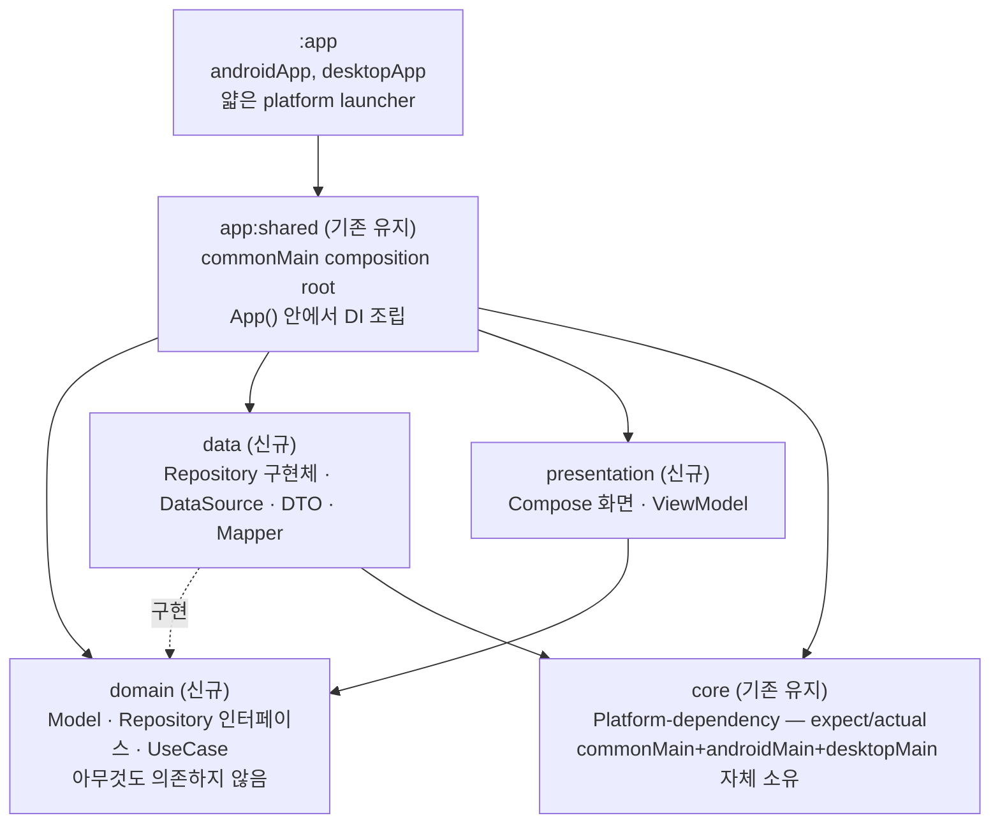
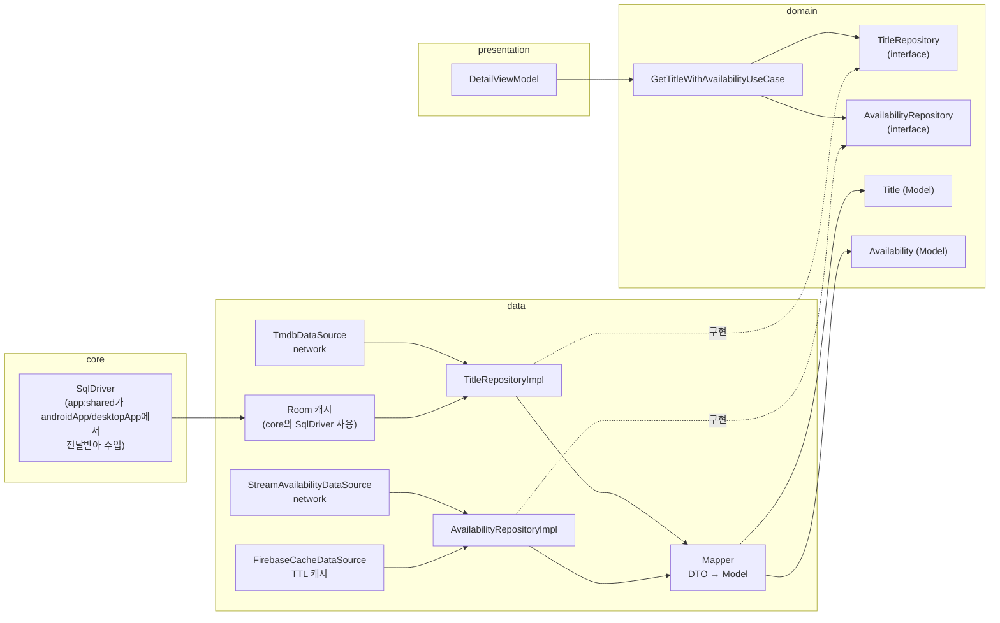
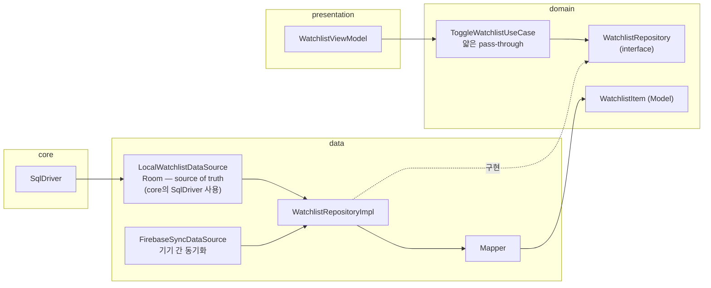

# StreamCompass 아키텍처 정리

*StreamCompass · Clean Architecture (Dependency Inversion) + KMP 5-모듈 구조*

모듈 경계, Repository/UseCase 분리 기준, 데이터 흐름 방향을 정리한 문서입니다. Uncle Bob의 Clean Architecture 원칙에 따라 **Repository 인터페이스는 domain에, 구현체는 data에** 둡니다. 기존 `:app:shared`/`:core` 모듈은 이름과 위치를 그대로 유지하고, `:domain`/`:presentation`/`:data`를 신규 모듈로 추가합니다(2026-07-27 확정 — 기존 모듈 개명이 아니라 신규 생성).

## 모듈 구조 · androidApp / desktopApp 기준

**현재 실제 저장소 상태 확인 결과 (2026-07-27):** `settings.gradle.kts`에는 이미 `:app:androidApp`, `:app:desktopApp`, `:app:shared`, `:app:webApp`, `:core`, `:server`가 존재합니다. `:app:shared`는 이미 `:core`를 `api`로 의존하며 Compose 의존성(`compose.material3`, `androidx.lifecycle.viewmodelCompose` 등)을 갖춘 실제 빌드 대상 공통 모듈이고, `:core`는 아직 `GreetingUtil.kt` 하나뿐인 빈 스캐폴드입니다. **이 두 모듈은 이름도 위치도 그대로 두고**, 다음 3개를 새로 추가합니다: `:domain`, `:presentation`, `:data`.

- `:domain` (신규) — Model(Entity) · Repository 인터페이스 · UseCase. 아무것도 의존하지 않음.
- `:data` (신규) — Repository 구현체 · DataSource · DTO · Mapper. `:domain`(DIP로 인터페이스 구현) + `:core`(platform 객체 타입 참조) 의존.
- `:presentation` (신규) — Compose 화면 · ViewModel. `:domain`만 의존.
- `:core` (기존 유지) — KMP platform-dependency 전용 모듈. DB 드라이버 등 `expect`/`actual`을 commonMain+androidMain+desktopMain(jvmMain)으로 자체 소유. 지금 비어있지만 역할은 이걸로 확정.
- `:app:shared` (기존 유지) — **commonMain composition root**로 확장. `:domain`+`:data`+`:presentation`+`:core`를 전부 의존해 `App()` 안에서 DI(Repository 인터페이스↔구현체 바인딩)를 조립. androidApp/desktopApp이 실제로 빌드하는 공통 진입 모듈이라는 기존 역할과 자연스럽게 맞아떨어짐(기존 `api(project(":core"))` 의존과도 일치).
- `:app:androidApp` / `:app:desktopApp` (기존 유지) — **얇은 platform 진입점(launcher)**. `:app:shared` + `:core`만 의존. `:core`의 `actual` 클래스를 실제 platform 인자(Android `Context` 등)로 생성해 `:app:shared`의 DI 조립 함수에 넘겨주는 일과 Activity/`main()` 호스팅만 담당.

> `data → domain`: Repository 구현체가 domain 인터페이스를 구현하기 위한 컴파일 의존(Dependency Inversion). `data → core`: platform 객체 타입(예: `SqlDriver`)을 참조하기 위한 일반 의존 — 인터페이스 반전 아님. `app:shared`가 4개 모듈을 전부 의존해 DI를 조립하는 유일한 지점입니다. `:app`(androidApp/desktopApp을 묶은 표기)은 `app:shared`만 의존하는 진짜 얇은 launcher로 남습니다 — `core`의 actual 생성 등 platform별 세부 사항은 각자의 실제 모듈(androidApp/desktopApp) 안에서 처리되지만, 다이어그램 상 화살표는 `app:shared` 하나로 단순화합니다.

## 근거 · Clean Architecture 원칙

**Repository가 data가 아니라 domain에 인터페이스로 남는 이유**

- **Dependency Rule** — 소스 코드 의존성은 오직 안쪽(고수준 정책)으로만 향해야 합니다. `domain`(Entity·UseCase)은 가장 안쪽 레이어이므로 바깥쪽인 `data`(프레임워크·DB·네트워크)를 알아서는 안 됩니다.
- **Dependency Inversion Principle** — domain이 필요로 하는 동작(Repository)을 domain이 인터페이스로 선언하고, 바깥쪽 layer(`data`)가 그 인터페이스를 구현합니다. 런타임 호출은 `domain → data` 방향이지만 소스 코드 의존(컴파일 의존)은 `data → domain`으로 뒤집힙니다.
- **Entity/UseCase는 프레임워크 독립적** — `domain`은 Room, Retrofit, Firebase SDK, `core`의 platform 드라이버도 전혀 참조하지 않습니다.
- **Model은 domain 소유** — Repository 인터페이스가 반환하는 타입(`Title`, `Availability`, `WatchlistItem`)은 `domain`에 정의된 Model입니다. DTO·Mapper(DTO → Model)는 구현체와 함께 `data`에 위치합니다.

## 근거 · `core`가 platform-dependency 전용 모듈인 이유 + `app:shared`가 composition root인 이유

- CMP는 UI(Compose)는 commonMain만으로 대부분 해결되지만, **DB(Room/SQLDelight) 드라이버처럼 플랫폼마다 실제 생성자 인자가 다른 부분**(Android는 `Context` 필요, Desktop은 불필요)은 `expect`/`actual`이 필요합니다.
- Kotlin 제약: `expect` 선언과 `actual` 구현은 **반드시 같은 Gradle 모듈** 안에서 target별 source set으로 존재해야 합니다. 그래서 `:core`는 commonMain(expect)+androidMain(actual)+desktopMain(actual)을 전부 자기 안에 소유합니다.
- 다만 **생성자 인자가 platform마다 다르므로**(Android는 Context 필요) `:core`의 actual 클래스를 실제로 "생성"하는 코드는 `app:shared`의 commonMain이 아니라, Context/플랫폼 자원을 실제로 들고 있는 `app:androidApp`/`app:desktopApp`에 남습니다 — 이건 `expect`/`actual`을 구현하는 게 아니라 이미 완성된 `:core`의 public 클래스를 생성자 호출하는 평범한 코드라 위반이 아닙니다.
- 그렇게 만들어진 platform 객체(예: `SqlDriver`)를 `app:androidApp`/`app:desktopApp`이 `app:shared`의 DI 조립 함수(예: `fun App(driver: SqlDriver)`)에 인자로 넘기면, 나머지 DI 조립(Repository 인터페이스↔구현체 바인딩 등 platform 무관한 부분)은 전부 `app:shared`의 commonMain에서 한 번에 처리됩니다 — 그래서 `app:shared`가 "commonMain composition root"입니다.
- `app:shared`가 `:core`를 `api`로 의존해야 하는 이유: `app:shared`의 public 함수 시그니처(`fun App(driver: SqlDriver)`)에 `:core`의 타입이 노출되므로, `app:androidApp`/`app:desktopApp`이 이 타입을 resolve하려면 `api` 전이 의존이 필요합니다. `:domain`/`:data`/`:presentation`은 `app:shared` 내부 구현에서만 쓰이고 외부(androidApp/desktopApp)에 타입을 노출하지 않는다면 `implementation`으로 충분합니다.

## 확정 사항

| 상태    | 내용                                                                                                                 |
|-------|----------------------------------------------------------------------------------------------------------------|
| ✅ 확정  | 기존 `:app:shared`, `:core` 모듈은 **개명하지 않고 그대로 유지**. `:domain`, `:presentation`, `:data`를 신규 생성.                        |
| ✅ 확정  | `:core`는 KMP platform-dependency 전용 모듈 역할로 확정 — DB 드라이버 등 expect/actual을 자체 소유.                                     |
| ✅ 확정  | `:app:shared`는 commonMain composition root로 확장 — `:domain`+`:data`+`:presentation`+`:core`를 전부 의존, `App()`에서 DI 조립. |
| ✅ 확정  | `:app:androidApp`/`:app:desktopApp`은 `:app:shared`+`:core`만 의존하는 얇은 launcher로 유지 — `:domain`/`:data`/`:presentation` 직접 참조 안 함. |
| ✅ 확정  | 컴파일 의존 방향은 `data → domain`(Dependency Inversion). `domain`은 어떤 모듈도 의존하지 않음.                                            |
| ✅ 확정  | Repository **인터페이스**·Model·UseCase는 `domain`. Repository **구현체**·DataSource·DTO·Mapper는 `data`(+platform 객체는 `core` 참조). |
| 🆕 신규 | `domain`·`presentation`·`data` 모듈은 현재 프로젝트에 존재하지 않음. `settings.gradle.kts`에 `include(":domain")`, `include(":presentation")`, `include(":data")` 추가부터 시작. |

## 데이터 흐름 · 읽기 전용 소스

**Title / Availability — 구현체가 data 안에서 domain model로 매핑**

Repository 인터페이스는 `domain`, 구현체·DataSource·Mapper는 `data`에 있습니다. Title은 Room 캐시를 쓰므로 `data`가 `core`의 platform 객체(`SqlDriver`)도 참조합니다 — 실제 인스턴스는 `app:androidApp`/`app:desktopApp`이 만들어 `app:shared`를 거쳐 주입됩니다.

> 식별자가 다릅니다 — Title은 titleId, Availability는 titleId + region. 갱신 주기도 다릅니다 — Title은 장기 캐시, Availability는 Firebase로 짧은 TTL 캐싱. 그래서 하나의 Repository로 합치지 않습니다.

## 데이터 흐름 · 사용자 쓰기 + 동기화

**Watchlist — local-first, Firebase는 동기화 보조 수단**

단순 토글이라 조합할 대상은 없지만, `presentation`은 `domain`만 의존한다는 규칙을 지키기 위해 얇은 pass-through UseCase 하나를 둡니다. Room이 source of truth이므로 여기서도 `core`의 `SqlDriver`를 사용합니다.

> 쓰기 주체가 사용자입니다. Room이 진실 공급원(source of truth)이고 Firebase는 여러 기기 간 동기화만 담당 — Title/Availability의 "읽기 전용 + 캐시" 정책과는 다른 형태라 별도 Repository입니다.

## Repository 분리 기준 — 왜 셋으로 나뉘는가

| 기준     | Title     | Availability            | Watchlist              |
|--------|-----------|-------------------------|------------------------|
| 식별자    | `titleId` | `titleId + region`      | `userId + titleId`     |
| 종속 시스템 | TMDB API  | Stream Availability API | 사용자 액션                 |
| 일관성 정책 | 정적, 장기 캐시 | 휘발성, TTL 짧게             | local-first + 기기 간 동기화 |
| 쓰기 주체  | 읽기 전용     | 읽기 전용                   | 사용자가 직접 씀              |

## 의존성 규칙 — "domain은 data도 core도 모른다"

**정상**
- `data`가 `domain`에 정의된 Repository 인터페이스를 구현 (`data → domain` 컴파일 의존, Dependency Inversion)
- `data`가 `core`가 제공하는 platform 객체 타입(`SqlDriver` 등)을 참조 (`data → core`, 일반 의존 — 인터페이스 반전 아님)
- `domain`의 UseCase는 Repository **인터페이스**만 참조·호출
- `core`는 `expect`/`actual` 쌍을 자기 모듈 안에서 전부 해결
- `app:androidApp`/`app:desktopApp`이 `core`의 이미 완성된 actual 클래스를 platform 인자(Context 등)로 **생성**해서 `app:shared`에 넘기는 것 — 이건 actual을 구현하는 게 아니라 생성자 호출일 뿐이므로 정상
- `app:shared`가 `domain`+`data`+`presentation`+`core`를 전부 의존해 DI 조립을 수행

**위반**
- `domain`이 `data`나 `core`의 어떤 타입이라도 import
- `presentation`이 `data`·`core`의 타입을 직접 참조 — 반드시 `domain`의 인터페이스·UseCase를 통해서만
- `core`의 `expect` 선언에 대한 `actual`을 `core` 바깥(예: `app:androidApp`)에 구현하려는 시도 (Kotlin이 지원하지 않음)
- `app:androidApp`/`app:desktopApp`이 `domain`/`data`/`presentation`을 직접 참조 (이들은 `app:shared`를 통해서만 접근 — 얇은 launcher 유지 규칙 위반)

---

**Repository** = domain이 선언하는 계약 — 식별자·종속 시스템·캐시 정책·쓰기 주체가 하나로 통일되는 경계. 인터페이스는 `domain`, 구현은 `data`.

**UseCase** = domain의 재사용 단위 — 여러 Repository를 조합하거나 로직이 재사용될 때만 존재. 단순 화면도 pass-through UseCase로 domain을 거침.

**core** = KMP platform-dependency 전용 모듈(기존 유지) — expect/actual을 자기 모듈 안에서 완결.

**app:shared** = commonMain composition root(기존 유지, 역할 확장) — domain+data+presentation+core를 모아 DI를 조립하고 androidApp/desktopApp에 완성된 `App()`을 제공.

의존 방향은 **컴파일 시 `data → domain`(Dependency Inversion) + `data → core`(platform 객체 타입 참조), 런타임 호출은 `domain → data`(구현체, DI로 주입)** — Uncle Bob Clean Architecture 원칙과 KMP expect/actual 제약을 함께 반영합니다.

*StreamCompass · 2026-07-27*
