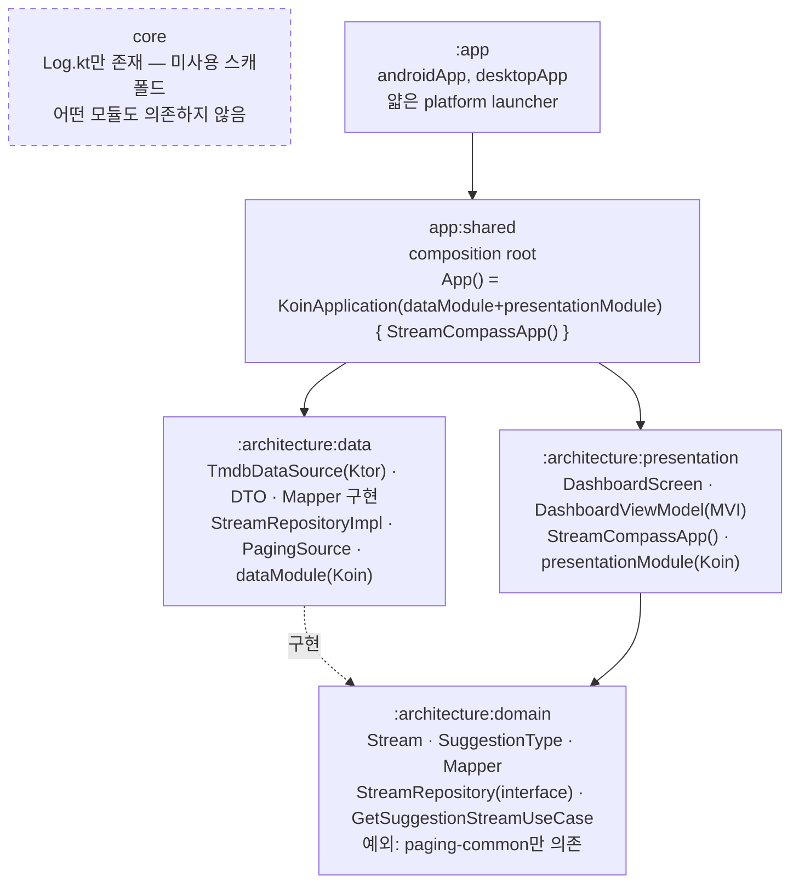
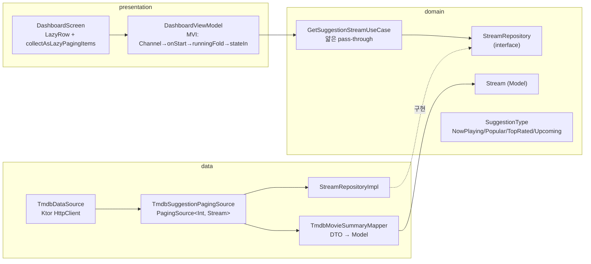

# StreamCompass 아키텍처 정리

*StreamCompass · Clean Architecture (Dependency Inversion) + KMP 모듈 구조*

모듈 경계, Repository/UseCase 분리 기준, 데이터 흐름 방향을 정리한 문서입니다. Uncle Bob의 Clean Architecture 원칙에 따라 **Repository 인터페이스는 domain에, 구현체는 data에** 둡니다.

> 이 문서는 2026-07-27 초기 설계본을 실제 구현 상태에 맞춰 갱신한 버전입니다(2026-08-05). 초기 설계에서 구상했던 Title/Availability/Watchlist 3-Repository(Room 캐시 + Firebase 동기화) 체계는 아직 구현되지 않았고, 실제로는 TMDB 단일 데이터소스를 사용하는 **Stream 통합 모델 + 단일 Repository**로 범위가 좁혀져 구현되었습니다. 아래 내용은 그 실제 구현을 기준으로 합니다.

## 모듈 구조 · 실제 구현 기준 (2026-08-05)

`settings.gradle.kts` 기준 실제 모듈: `:app:androidApp`, `:app:desktopApp`, `:app:shared`, `:architecture:domain`, `:architecture:data`, `:architecture:presentation`, `:core`.

- `:architecture:domain` — Model(`Stream`) · `SuggestionType` · `Mapper<Source, Payload>` 인터페이스 · Repository 인터페이스(`StreamRepository`) · UseCase(`GetSuggestionStreamUseCase`). 원칙상 다른 모듈을 의존하지 않지만, **예외로 `paging-common`만 `implementation`으로 의존**합니다 — KMP 순수 라이브러리이고 Android/UI 커플링이 없어 Repository 계약(`Flow<PagingData<Stream>>`)에 필요하기 때문입니다(빌드 파일 주석으로 명시).
- `:architecture:data` — `TmdbDataSource`(Ktor) · DTO · Mapper(`TmdbMovieSummaryMapper`, `TmdbMovieDetailMapper`) · `StreamRepositoryImpl` · `TmdbSuggestionPagingSource` · Koin 모듈(`dataModule`). `:architecture:domain`만 `implementation`으로 의존 — **`:core`는 의존하지 않습니다.**
- `:architecture:presentation` — Compose 화면(`DashboardScreen`) · ViewModel(`DashboardViewModel`, MVI 패턴) · Koin 모듈(`presentationModule`) · 최상위 진입 Composable `StreamCompassApp()`. `:architecture:domain`만 의존.
- `:core` — 현재 `Log.kt`(Android Logcat 스타일 로거) 하나만 존재하는 **미사용 스캐폴드**입니다. 어떤 모듈도 `:core`를 의존하지 않습니다(`grep` 확인, 2026-08-05). **초기 설계의 "DB 드라이버 등 expect/actual 전용 모듈" 역할은 폐기되었습니다(2026-08-05)** — 각 모듈이 필요한 `expect`/`actual`을 자기 모듈 내부에서 직접 선언하기로 결정. `:core`는 이제 순수 공용 유틸리티(로거 등) 전용 모듈로 범위가 좁혀졌습니다.
- `:app:shared` — commonMain composition root. `:architecture:data` + `:architecture:presentation` + `koin-compose`를 의존. `App()` Composable이 `KoinApplication(configuration = koinConfiguration { modules(dataModule, presentationModule) }) { StreamCompassApp() }` 형태로 두 모듈의 Koin 모듈을 조립하고 presentation의 최상위 Composable을 호스팅합니다. **`:architecture:domain`/`:core`는 직접 의존하지 않습니다** — `App.kt`가 domain/core의 타입을 직접 참조하지 않기 때문에 `implementation` 전이 의존만으로 충분합니다.
- `:app:androidApp` / `:app:desktopApp` — 얇은 platform 진입점. 각각 `:app:shared`만 의존하고 `MainActivity`/`main()`에서 `App()` Composable을 호출할 뿐, `:architecture:*`/`:core`를 직접 참조하지 않습니다.

**타겟 플랫폼**: `:architecture:domain`/`:architecture:data`/`:architecture:presentation`/`:core` 모두 `jvm()` + `android()` **두 타겟만** 구성되어 있습니다. 초기 설계에서 언급했던 iosArm64/iosSimulatorArm64/js/wasmJs 타겟은 실제로는 추가되지 않았습니다.

> `data → domain`: Repository 구현체가 domain 인터페이스를 구현하기 위한 컴파일 의존(Dependency Inversion). `:core`는 점선으로 표시된 대로 현재 그래프에서 고립되어 있습니다. `app:shared`가 data+presentation을 조립하는 유일한 지점이고, `:app`(androidApp/desktopApp)은 `app:shared`만 의존하는 얇은 launcher로 남습니다.

## 근거 · Clean Architecture 원칙

**Repository가 data가 아니라 domain에 인터페이스로 남는 이유**

- **Dependency Rule** — 소스 코드 의존성은 오직 안쪽(고수준 정책)으로만 향해야 합니다. `domain`(Entity·UseCase)은 가장 안쪽 레이어이므로 바깥쪽인 `data`(프레임워크·DB·네트워크)를 알아서는 안 됩니다.
- **Dependency Inversion Principle** — domain이 필요로 하는 동작(`StreamRepository`)을 domain이 인터페이스로 선언하고, 바깥쪽 layer(`data`)의 `StreamRepositoryImpl`이 그 인터페이스를 구현합니다. 런타임 호출은 `domain → data` 방향이지만 소스 코드 의존(컴파일 의존)은 `data → domain`으로 뒤집힙니다.
- **Entity/UseCase는 프레임워크 독립적** — `domain`은 Ktor, kotlinx.serialization, Compose, `core`의 로거도 전혀 참조하지 않습니다(`paging-common`만 예외).
- **Model은 domain 소유** — Repository 인터페이스가 반환하는 타입(`Stream`)은 `domain`에 정의된 Model입니다. DTO(`TmdbMovieSummaryDto` 등)·Mapper 구현체(DTO → `Stream`)는 구현체와 함께 `data`에 위치합니다.

## `:core`의 역할 재정의 — 플랫폼별 expect/actual은 각 모듈이 직접 소유 (2026-08-05)

- 초기 설계에서는 Room/SqlDriver처럼 플랫폼별 생성자 인자가 다른 부분(`expect`/`actual`)을 `:core`가 자체 소유하는 "platform-dependency 허브" 모듈로 구상했습니다. **이 구상은 더 이상 유효하지 않습니다.**
- 대신, 특정 모듈에 플랫폼별 분기(`expect`/`actual`)가 필요해지면 **그 모듈 자신이** `commonMain`+`androidMain`+`jvmMain` source set을 갖춰 내부에서 직접 선언·구현하기로 결정했습니다. `:core`를 경유하지 않습니다.
  - 예: `:architecture:data`가 Ktor HTTP 엔진을 `androidMain`(OkHttp)/`jvmMain`(CIO)으로 나눠 갖는 것이 이미 이 방식의 선례입니다(다만 이건 Ktor 자체의 멀티플랫폼 아티팩트 분리이지 `data`가 직접 `expect`/`actual` 키워드를 쓴 것은 아님 — 향후 실제 `expect`/`actual`이 필요해지면 같은 원칙, 즉 필요 모듈이 자체 소유하는 방식을 따릅니다).
- `:core`는 이제 특정 도메인/레이어에 종속되지 않는 **순수 공용 유틸리티**(현재는 `Log.kt`)만 담당합니다. 여러 모듈에서 공통으로 재사용할 순수-Kotlin 유틸이 생기면 여기에 추가하되, 플랫폼별 `actual` 구현이 필요한 코드를 이 모듈에 다시 모으지 않습니다.

## 확정 사항

| 상태    | 내용                                                                                                                                                                                                                       |
|-------|--------------------------------------------------------------------------------------------------------------------------------------------------------------------------------------------------------------------------|
| ✅ 확정  | 컴파일 의존 방향은 `data → domain`(Dependency Inversion). `domain`은 `paging-common` 예외를 제외하고 어떤 모듈도 의존하지 않음.                                                                                                                          |
| ✅ 확정  | Repository **인터페이스**·Model·UseCase는 `domain`. Repository **구현체**·DataSource·DTO·Mapper 구현·Koin DI 모듈은 `data`.                                                                                                            |
| ✅ 확정  | `:architecture:*` 3개 모듈 + `:core` 모두 `jvm()` + `android()` 두 타겟만 구성. iOS/JS/wasmJs 타겟 없음.                                                                                                                                  |
| ✅ 확정  | `:core`는 현재 어떤 모듈에서도 의존하지 않는 미사용 스캐폴드 — `Log.kt`만 존재.                                                                                                                                                                     |
| ✅ 확정 (2026-08-05) | `:core`를 DB 드라이버 등 `expect`/`actual`의 중앙 허브로 쓰는 초기 설계는 폐기. 플랫폼별 분기가 필요한 모듈은 자기 자신이 `expect`/`actual`을 직접 소유·구현. `:core`는 순수 공용 유틸리티 전용으로 범위 축소.                                                                              |
| ✅ 확정  | `app:shared`는 `:architecture:data`+`:architecture:presentation`+`koin-compose`만 의존 — `domain`/`core`는 직접 의존하지 않음(타입 노출이 없으므로 `implementation`으로 충분).                                                                             |
| ✅ 확정  | `:app:androidApp`/`:app:desktopApp`은 `:app:shared`만 의존하는 얇은 launcher — `:architecture:*`/`:core` 직접 참조 안 함.                                                                                                               |
| ✅ 완료  | `:architecture:domain`, `:architecture:data`, `:architecture:presentation` 모듈 생성 완료(2026-08-01), `architecture/` 폴더 하위로 배치.                                                                                              |
| ✅ 완료  | TMDB 기반 `Stream` 통합 모델 + `StreamRepository`(추천 목록 페이징 조회 `getSuggestionStreamFlow` + 상세 조회 `getStream`) 구현 완료. Ktor(`androidMain`→OkHttp engine, `jvmMain`→CIO engine) + kotlinx.serialization(`coerceInputValues=true` 필수 — TMDB가 poster/backdrop에 explicit null을 보냄) + AndroidX Paging 3.                     |
| ✅ 완료  | Koin DI 도입 — `dataModule`(data), `presentationModule`(presentation)을 `app:shared`의 `App()`에서 `KoinApplication { modules(...) }`로 조립. Mapper는 `named()` qualifier로 summary/detail 두 종류를 구분해 바인딩.                                       |
| ✅ 완료  | Dashboard 화면(`DashboardScreen`)에서 `LazyRow` + Paging Compose(`collectAsLazyPagingItems`)로 Now Playing / Upcoming 두 개의 추천 목록을 페이징 렌더링. `key`는 `"${index}_${tmdbId}"` 합성 키로 유일성을 보장(TMDB 페이지 간 중복 tmdbId 대응). Coil3 `AsyncImage` + per-request `crossfade(true)`.  |
| ℹ️ 의도됨 | TMDB API Key가 `architecture/data/build.gradle.kts`의 `buildkonfig { defaultConfigs { buildConfigField(STRING, "TMDB_API_KEY", "...") } }`에 평문으로 들어있는 것은 **의도된 임시 상태**입니다 — test key라 노출 위험이 없고, 추후 Firebase Remote Config에서 받아오도록 교체될 예정입니다. |
| ⏸️ 미구현 | 초기 설계의 Title/Availability/Watchlist 3-Repository 분리, Room 로컬 캐시, Firebase 동기화는 아직 구현되지 않음 — 현재는 TMDB 단일 소스의 `Stream` 통합 모델과 단일 `StreamRepository`만 존재. TMDB API Key의 Firebase Remote Config 전환도 이 범주.                                                        |

## 데이터 흐름 · Stream 추천 목록 (실제 구현)

**Dashboard의 Now Playing / Upcoming 목록 — TMDB 페이징 응답을 Stream 모델로 매핑**

> 상세 조회(`getStream(streamId)`)는 `TmdbMovieDetailMapper`를 통해 동일한 `Stream` 모델로 매핑되며, 아직 화면에서 사용되지 않음(`DashboardScreen`의 아이템 클릭은 TODO 상태의 콜백만 연결되어 있음 — 상세 화면 네비게이션 미구현).

## Presentation 계층 · MVI 패턴 (`DashboardViewModel`)

단일 리듀서 파이프라인 원칙을 따릅니다 — 초기 로드와 이후 이벤트 모두 동일한 `handleEvent` 리듀서를 거칩니다.

- `eventChannel: Channel<Event>`가 유일한 이벤트 진입점.
- `.onStart { emit(Event.Initialize) }`로 구독 시작 시 초기화 이벤트를 이벤트 소스 자체에 흘려보냄(별도 State 파이프라인에서 경쟁 emit하지 않음).
- `.runningFold(initial = State(), operation = ::handleEvent)`로 이벤트를 리듀스.
- `.stateIn(scope = viewModelScope, started = SharingStarted.WhileSubscribed(5_000), initialValue = State())`로 `StateFlow` 노출.
- `Event.Initialize` 처리 시 `GetSuggestionStreamUseCase`를 `SuggestionType.NowPlaying`/`SuggestionType.Upcoming` 두 번 호출해 각각 `cachedIn(viewModelScope)`로 캐싱한 `Flow<PagingData<Stream>>`를 `State`에 담음.

## 의존성 규칙 — "domain은 data도 core도 모른다"

**정상**
- `data`가 `domain`에 정의된 Repository 인터페이스를 구현 (`data → domain` 컴파일 의존, Dependency Inversion)
- `domain`의 UseCase는 Repository **인터페이스**만 참조·호출
- `data`가 플랫폼별 Ktor 엔진을 `androidMain`(OkHttp)/`jvmMain`(CIO) source set으로 나눠 갖는 것 — Ktor 자체 expect/actual 메커니즘이며 `data`가 직접 `expect`/`actual`을 선언하지 않음
- `app:shared`가 `data`+`presentation`의 Koin 모듈을 조립해 DI를 완성

**위반**
- `domain`이 `data`·`presentation`·`core`의 어떤 타입이라도 import (단, `paging-common`은 명시적 예외로 합의됨)
- `presentation`이 `data`의 타입을 직접 참조 — 반드시 `domain`의 인터페이스·UseCase를 통해서만
- `app:androidApp`/`app:desktopApp`이 `domain`/`data`/`presentation`을 직접 참조 (이들은 `app:shared`를 통해서만 접근 — 얇은 launcher 유지 규칙 위반)
- API Key 등 실제 운영 비밀값을 git-tracked 파일에 평문으로 커밋 (단, 현재 `TMDB_API_KEY`는 test key라는 사용자 확인을 받은 의도된 예외 — 위 확정 사항 표 참고)

---

**Repository** = domain이 선언하는 계약. 인터페이스는 `domain`, 구현은 `data`.

**UseCase** = domain의 재사용 단위 — 여러 Repository를 조합하거나 로직이 재사용될 때만 존재. 단순 화면도 pass-through UseCase로 domain을 거침 (`GetSuggestionStreamUseCase`가 그 예).

**core** = 순수 공용 유틸리티 전용 모듈(현재는 로거 `Log.kt`만 존재, 미사용 스캐폴드). 초기 설계였던 "플랫폼별 expect/actual 중앙 허브" 역할은 폐기되었고, 각 모듈이 필요한 expect/actual을 자체 소유하는 방식으로 확정.

**app:shared** = commonMain composition root — 현재는 `data`+`presentation`의 Koin 모듈만 조립(`domain`/`core`는 직접 의존하지 않음)하고 androidApp/desktopApp에 완성된 `App()`을 제공.

의존 방향은 **컴파일 시 `data → domain`(Dependency Inversion), 런타임 호출은 `domain → data`(구현체, Koin으로 주입)** — Uncle Bob Clean Architecture 원칙을 반영합니다. KMP `expect`/`actual`이 필요한 플랫폼별 기능은 `:core`로 모으지 않고 필요한 모듈이 각자 소유하기로 확정(2026-08-05)했으므로, `core`는 앞으로도 순수 공용 유틸리티 범위를 벗어나지 않을 예정입니다.

*StreamCompass · 2026-08-05 갱신 (최초 작성 2026-07-27)*
