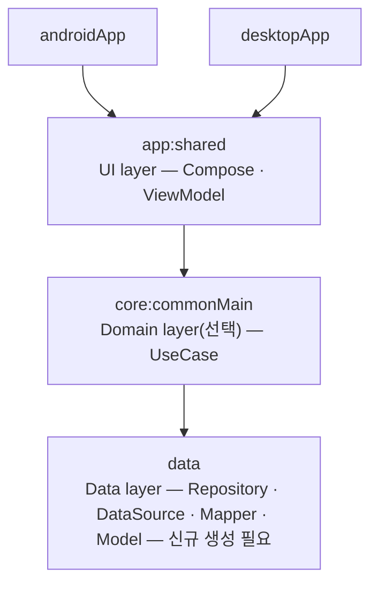
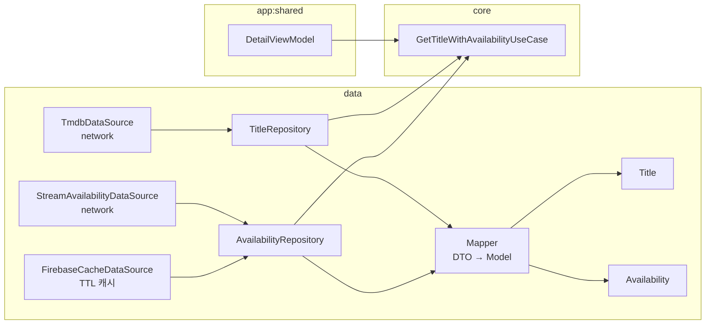
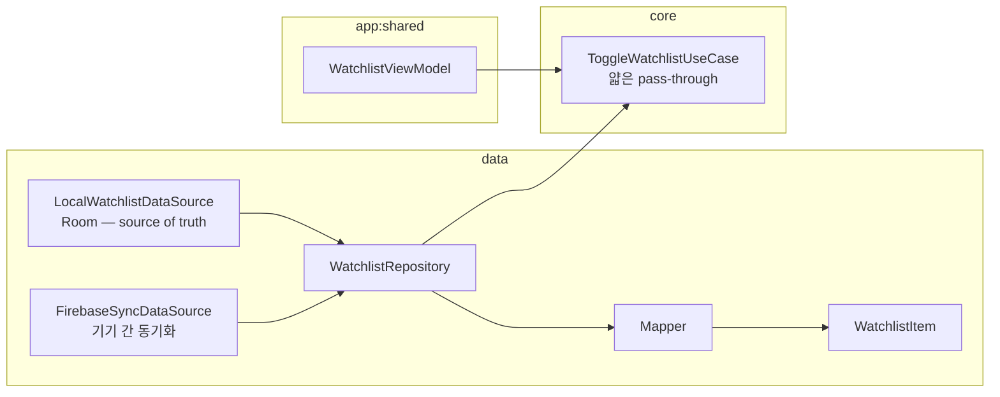

# StreamCompass 아키텍처 정리

*StreamCompass · Android 공식 권장 아키텍처 기반*

모듈 경계, Repository/UseCase 분리 기준, 데이터 흐름 방향을 정리한 문서입니다. [Android 공식 가이드](https://developer.android.com/topic/architecture)를 기준으로 Repository/DataSource를 data layer에 배치합니다.

## 모듈 구조 · androidApp / desktopApp 기준

[Android 공식 가이드](https://developer.android.com/topic/architecture)는 Repository·DataSource를 전부 **Data layer**에 두고, Domain layer(선택)는 UseCase만 담당하도록 합니다. 의존 방향은 UI → Domain → Data 단방향입니다. 이 프로젝트에 맞추면 `core` = domain(UseCase 전용), `data` = Repository·DataSource·Mapper·Model이 됩니다. `app:shared`는 여전히 `core`만 의존합니다 — 단순한 화면도 core를 거치도록 얇은 pass-through UseCase를 둡니다(2026-07-26 확정).

> app:shared → core만 의존(항상), core → data 단방향 의존. androidApp/desktopApp은 여전히 app:shared 하나만 봅니다. iOS·web·server는 별도 요청 전까지 이 정리에서 제외합니다.

## 근거 · Android 공식 가이드

**Repository가 domain이 아니라 data에 남는 이유**

- **Data layer**
  - 공식 가이드 원문: "저장소 클래스에서 담당하는 작업 — 앱의 나머지 부분에 데이터 노출 / 데이터 변경사항을 한곳에 집중 / 여러 데이터 소스 간의 충돌 해결 / 데이터 소스 추상화 / 비즈니스 로직 포함"
  - caching·데이터 소스 선정 같은 정책도 "데이터를 다루는 책임"으로 분류되어 Repository(Data layer) 소관 — Google은 policy/mechanism이 아니라 "무엇을 다루는 책임인가"로 layer를 가릅니다
- **그럼 Domain(core)은?**
  - 공식 가이드 원문: "도메인 레이어는 복잡한 비즈니스 로직이나 여러 뷰모델에서 재사용되는 간단한 비즈니스 로직의 캡슐화를 담당" — Repository 여러 개를 조합하거나 로직이 재사용될 때만 UseCase로 존재
  - 가이드상 Domain layer는 선택사항이라 단순 화면은 UI가 Data layer를 직접 호출해도 되지만, 이 프로젝트는 **항상 core를 거치기로 확정** — 단순 조회도 얇은 pass-through UseCase로 감쌈

## 확정 사항

| 상태       | 내용                                                                                                 |
|----------|----------------------------------------------------------------------------------------------------|
| ✅ 확정     | 의존 방향은 `presentation(app:shared) → domain(core) → data` 단방향 유지. `core`가 `data`를 의존.                |
| ✅ 확정     | Repository·DataSource·Mapper·Model 전부 `data`에 위치 — Android 공식 가이드와 동일하게 배치.                        |
| ✅ 확정     | `core`는 UseCase만 담당. 단순 화면도 core를 거치도록 얇은 pass-through UseCase를 둠 (app:shared → data 직접 의존 금지 유지). |
| 🆕 신규 생성 | `data` 모듈은 현재 프로젝트에 존재하지 않음. `settings.gradle.kts`에 `include(":data")` 추가부터 시작.                    |

## 데이터 흐름 · 읽기 전용 소스

**Title / Availability — Repository가 data 안에서 domain model로 매핑**

Repository와 Mapper 모두 `data` 안에 있습니다. UseCase(`core`)는 완성된 Model을 돌려주는 Repository를 인터페이스 바인딩 없이 직접 호출만 합니다. 두 Repository를 동시에 써야 하는 화면이라 UseCase가 조합을 담당합니다.

> 식별자가 다릅니다 — Title은 titleId, Availability는 titleId + region. 갱신 주기도 다릅니다 — Title은 장기 캐시, Availability는 Firebase로 짧은 TTL 캐싱. 그래서 하나의 Repository로 합치지 않습니다.

## 데이터 흐름 · 사용자 쓰기 + 동기화

**Watchlist — local-first, Firebase는 동기화 보조 수단**

단순 토글이라 조합할 대상은 없지만, app:shared는 core만 의존한다는 규칙을 지키기 위해 얇은 pass-through UseCase 하나를 둡니다.

> 쓰기 주체가 사용자입니다. Room이 진실 공급원(source of truth)이고 Firebase는 여러 기기 간 동기화만 담당 — Title/Availability의 "읽기 전용 + 캐시" 정책과는 다른 형태라 별도 Repository입니다.

## Repository 분리 기준 — 왜 셋으로 나뉘는가

| 기준     | Title     | Availability            | Watchlist              |
|--------|-----------|-------------------------|------------------------|
| 식별자    | `titleId` | `titleId + region`      | `userId + titleId`     |
| 종속 시스템 | TMDB API  | Stream Availability API | 사용자 액션                 |
| 일관성 정책 | 정적, 장기 캐시 | 휘발성, TTL 짧게             | local-first + 기기 간 동기화 |
| 쓰기 주체  | 읽기 전용     | 읽기 전용                   | 사용자가 직접 씀              |

## 의존성 규칙 — "core가 data를 참조"가 정상이다 (이전과 반대 방향)

**정상**
- UseCase(`:core`)가 Repository(`:data`)를 직접 호출·참조 — 인터페이스 바인딩 불필요
- Mapper가 `:data` 안에서 DTO → Model 변환 (둘 다 `:data`에 있으므로 자연스러움)
- Model(`Title` 등)은 `:data`에 정의되고 `:core`·`:app:shared`까지 위로 흐름

**위반**
- `:data`가 `:core`의 UseCase나 core 전용 타입을 참조 (컴파일 불가 — data는 core를 의존하지 않음)
- `:app:shared`가 `:data`의 DataSource/DTO(내부 전용 타입)를 직접 참조 — Model·Repository의 공개 표면은 반드시 `:core`의 UseCase를 통해서만

---

**Repository** = data layer의 SSOT 단위 — 식별자·종속 시스템·캐시 정책·쓰기 주체가 하나로 통일되는 경계 (Android 공식 가이드와 동일한 위치).

**UseCase** = domain(core)의 재사용 단위 — 여러 Repository를 조합하거나 로직이 재사용될 때만 존재. 단순 화면도 pass-through UseCase로 core를 거침.

참조 방향은 이제 **presentation(app:shared) → domain(core) → data** 단방향, Android 공식 권장 아키텍처와 동일합니다.

*StreamCompass · 2026-07-26*
